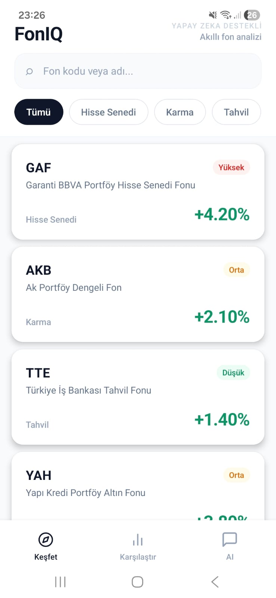
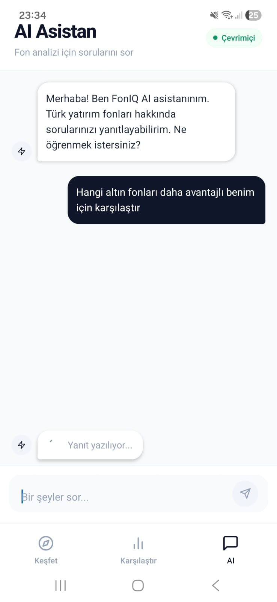
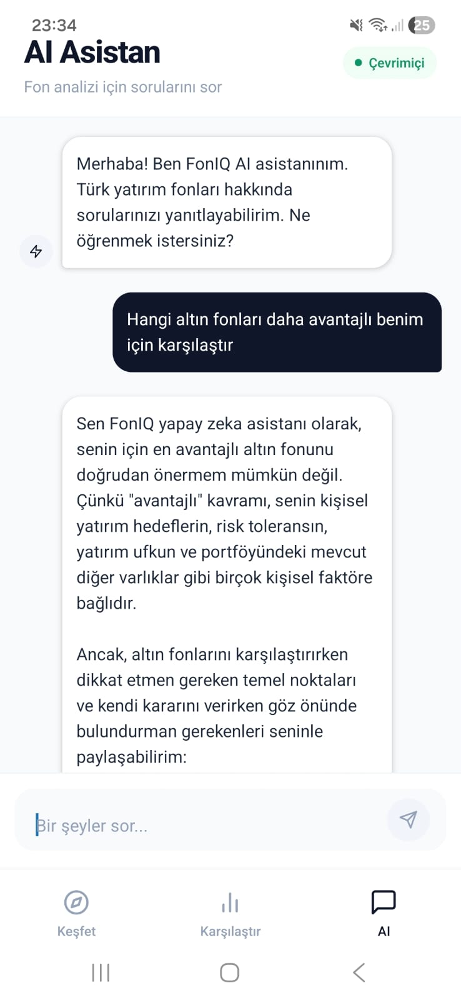

# FonIQ — Akıllı Fon Analizi

FonIQ, Türk yatırımcıların TEFAS fonlarını keşfetmesini, karşılaştırmasını ve yapay zeka destekli Türkçe yorum almasını sağlayan mobil uygulamadır.

---

## Ekran Görüntüleri

<p align="center">
  
  
  
  
</p>

---

## Özellikler

- **Fon Keşfi** — 20+ yatırım fonunu listele, kategori ve isme göre filtrele
- **Fon Detayı** — 1 aylık, 3 aylık, 6 aylık ve 1 yıllık getiri performansı
- **Fon Karşılaştırma** — 2 fonu yan yana karşılaştır, hangisinin daha iyi performans gösterdiğini gör
- **AI Yorumu** — Gemini AI ile Türkçe, kişiselleştirilmiş fon analizi al
- **AI Sohbet** — Yatırım fonları hakkında her şeyi sohbet şeklinde sor

---

## Teknoloji Stack

| Katman     | Teknoloji           |
| ---------- | ------------------- |
| Mobil      | React Native + Expo |
| Navigation | Expo Router         |
| State      | Zustand             |
| AI         | Google Gemini API   |
| Backend    | Node.js + Express   |
| Veri       | Mock TEFAS verisi   |

---

## Kurulum

### Gereksinimler

- Node.js 18+
- Expo Go (mobil cihaz) veya Android Emülatör
- Google Gemini API Key

### 1. Projeyi Klonla

```bash
git clone https://github.com/kullanici-adi/foniq.git
cd foniq
```

### 2. Bağımlılıkları Yükle

```bash
npm install
```

### 3. Ortam Değişkenlerini Ayarla

Proje kökünde `.env.local` dosyası oluştur:

```
EXPO_PUBLIC_GEMINI_API_KEY=senin_gemini_api_key
```

Gemini API key almak için: [aistudio.google.com](https://aistudio.google.com)

### 4. Backend'i Başlat

```bash
cd backend
npm install
node server.js
```

Backend `http://localhost:3000` adresinde çalışır.

### 5. Uygulamayı Başlat

```bash
cd ..
npx expo start
```

---

## Proje Yapısı

```
FonIQ/
├── app/
│   ├── (tabs)/
│   │   ├── index.tsx        # Keşfet ekranı
│   │   ├── compare.tsx      # Karşılaştır ekranı
│   │   └── ai.tsx           # AI Sohbet ekranı
│   └── fund/
│       └── [code].tsx       # Fon Detay ekranı
├── components/
│   ├── FundCard.tsx
│   ├── FundChart.tsx
│   ├── RiskBadge.tsx
│   └── ChatBubble.tsx
├── services/
│   ├── tefas.ts             # Fon veri servisi
│   └── gemini.ts            # AI servis
├── store/
│   ├── useProfileStore.ts   # Kullanıcı profili
│   └── useCompareStore.ts   # Karşılaştırma state
├── constants/
│   ├── colors.ts
│   └── config.ts
├── types/
│   └── fund.ts
└── backend/
    └── server.js            # Express proxy server
```

---

## Ekran Açıklamaları

### Keşfet

Tüm fonları listeler. Kategori chip'leri (Hisse Senedi, Karma, Tahvil, Altın, Para Piyasası) ile filtrelenebilir. Arama çubuğu ile fon kodu veya ismine göre arama yapılabilir.

### Fon Detayı

Seçilen fonun getiri performansını (1A, 3A, 6A, 1Y), portföy büyüklüğünü ve yatırımcı sayısını gösterir. AI yorumu butonu ile Gemini'den Türkçe analiz alınabilir.

### Karşılaştır

İki fon yan yana karşılaştırılır. Daha iyi performans gösteren metrik yeşil ile öne çıkar.

### AI Sohbet

Gemini AI ile sohbet formatında yatırım fonu soruları sorulabilir. Tamamen Türkçe yanıt verir.

---

## Geliştirme Notları

- TEFAS API CORS kısıtlaması nedeniyle direkt mobil erişim mümkün değildir. Bu nedenle Express.js proxy backend kullanılmaktadır.
- Şu an mock veri kullanılmaktadır. Backend değiştirilerek gerçek TEFAS verisi entegre edilebilir.
- Gemini API Free Tier günlük 1500 istek limitine sahiptir.

---

## Lisans

MIT License — Serbestçe kullanılabilir ve geliştirilebilir.

---

_FonIQ — Portföy projesi olarak geliştirilmiştir._
